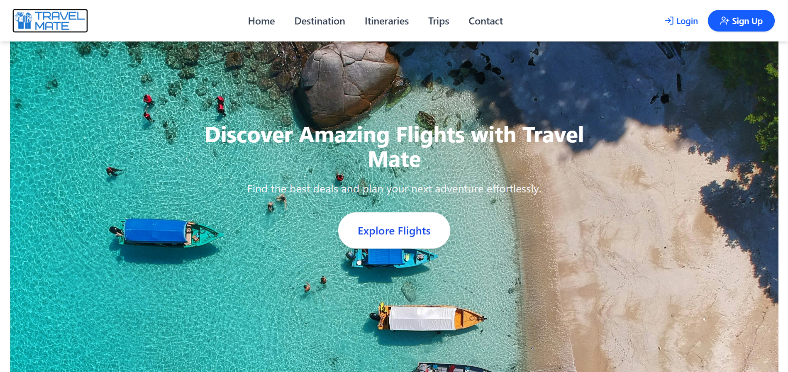
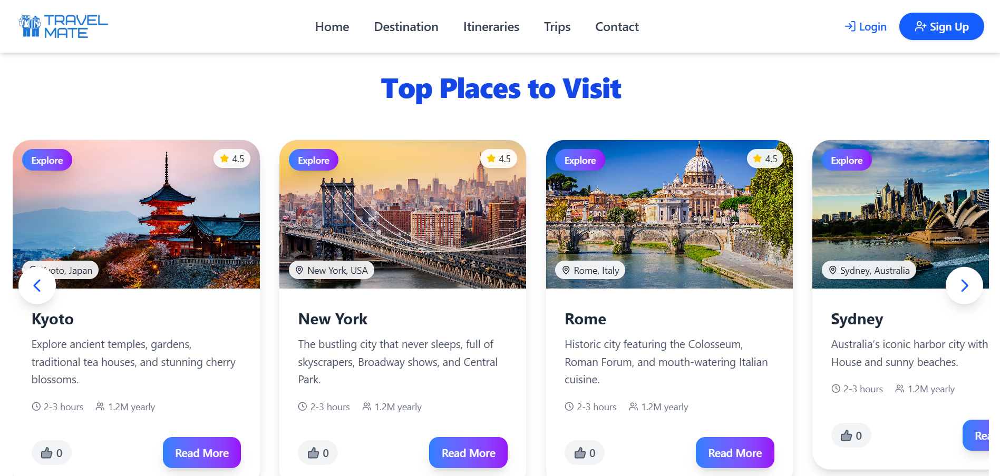

# 🌍 Travel Mate – Your Smart Travel Companion  

## ✨ Overview  
**Travel Mate** is a modern React-based travel planning web application that helps users explore destinations, find flights, create itineraries, and even connect with other travelers for group trips.  

Built with a focus on **user experience**, **performance**, Travel Mate simplifies trip planning — from discovery to booking.

---

## 🚀 Features  

✅ **Flight Search & Booking** – Integrated with Amadeus API for real-time flight data  
✅ **Dynamic Itinerary Planner** – Day-by-day itinerary with maps, activities & custom trips   
✅ **Group Trip Planner** – Join or create trips with other travelers  
✅ **Modern UI** – Built with Tailwind CSS, Framer Motion & React Components  
✅ **Authentication & Authorization** – Secure login/signup system  
✅ **Responsive Design** – Works seamlessly across all devices  

---

## 🧰 Tech Stack  

**Frontend:** React.js, Tailwind CSS, Framer Motion  
**Backend:** Node.js, Express.js, MongoDB  
**API Integration:** Amadeus Flight Offers API, OpenAI API  
**State Management:** Context API 
**Deployment:** Vercel  

---

## 📸 Screenshots  

### 🏠 Homepage  


### 🌆 Destinations Page  



---

## ⚙️ Installation  

Clone the repo:  
```bash
git clone https://github.com/vaishnavi-2509/travel-mate-client.git
cd travel-mate-client
```

Install dependencies:  
```bash
npm install
```

Start the development server:  
```bash
npm run dev
```

Open in browser:  
👉 http://localhost:5173  

---

## 💡 Future Enhancements  
- Add hotel & activity booking integration  
- Include user dashboard for saved itineraries  
- Add travel expense tracker  

---

## 👩‍💻 Author  
**Vaishnavi Agrawal**  
Full Stack Developer | MERN Stack

📧 agrawalvaishnavi2905@gmail.com 
🌐 https://www.linkedin.com/in/vaishnavi-agrawal-a943192aa/
